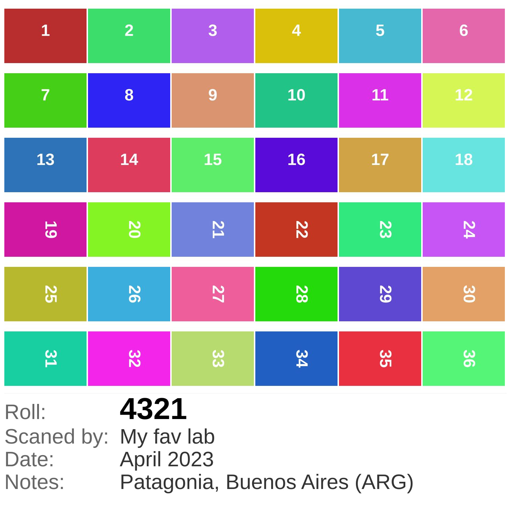

# Printable Contact Sheet Generator

Node.js script to create professional contact sheets from scanned photographic film images. Ideal for illustrating CD cases or file folders containing digitized photo collections.

> **Note:** This script was generated with **GitHub Copilot powered by Claude Sonnet 4.5**


*Example of a generated contact sheet with scanned film images*

## 📸 What does this script do?

This script generates a **printable contact sheet** in square format (1:1) of **120x120mm** at 300 DPI, containing:

- ✨ Preview of up to **36 images** (6x6 grid)
- 🏷️ Filename below each image
- 📋 Configurable information in the footer:
  - Contact sheet serial number
  - Laboratory that scanned the images
  - Approximate date of photographs
- 🎨 Minimalist and elegant design with white background
- 📐 Ready to print without additional adjustments

The script processes only JPEG/JPG files from the specified directory (excluding subdirectories).

### 🔄 Automatic orientation

All images are displayed in **landscape orientation** (horizontal) on the contact sheet:
- Images with width > height: displayed as-is
- Images with height > width: automatically rotated 90° to horizontal format

This ensures a consistent, horizontal layout perfect for catalog viewing.

## 🚀 Installation

### Prerequisites

- **Node.js** (version 16 or higher)
- **npm** (included with Node.js)

### Installation steps

1. Clone or download this repository:
```bash
git clone <repository-url>
cd printable-contact-sheet-from-dir
```

2. Install dependencies:
```bash
npm install
```

## 💻 Usage

### Basic syntax

```bash
npm start <directory-with-images>
```

### Example

```bash
npm start ./film-roll-01
```

### Generate test images

To test the contact sheet generator, you can create sample images:

```bash
npm run generate-test
```

This will create a `test/images/` directory with 36 test images:
- 18 horizontal images (3089×2048)
- 18 vertical images (2048×3089)
- Each with a different colored background and numbered

Then test the contact sheet generator:

```bash
npm start test/images
```

### Execution process

1. **Specify directory**: Provide the path to the directory containing JPEG images
2. **Answer questions**: The script will request the following optional information:
   - Contact sheet serial number
   - Laboratory that scanned the images
   - Approximate date of photos
   
   *You can press Enter to skip any field*

3. **Wait for generation**: The script will process the images and create the contact sheet
4. **Result**: The contact sheet will be saved in the same directory as the images with the name `contact-sheet-[timestamp].jpg`

## 📋 Complete example

```bash
$ npm start ./my-scanned-photos

╔════════════════════════════════════════════════╗
║   Printable Contact Sheet Generator           ║
║        For Photographic Film Scans             ║
╚════════════════════════════════════════════════╝

📁 Scanning directory: /home/user/my-scanned-photos

✓ Found 24 image(s)

Please provide the following information
(press Enter to skip any field):

🔢 Contact sheet serial number: CS-2024-001
🔬 Laboratory that scanned the images: LabFoto Digital
📅 Approximate date of photos: Summer 2023

📸 Creating contact sheet with 24 image(s)...

✅ Contact sheet created successfully!
📄 File: /home/user/my-scanned-photos/contact-sheet-1707345678901.jpg
📐 Dimensions: 1417x1417 pixels (120x120mm @ 300 DPI)

💡 This image is ready to print at 120x120mm format
```

## 🎨 Design features

- **Format**: Square 1:1 (120x120mm)
- **Resolution**: 300 DPI (professional print quality)
- **Grid**: Fixed 6 rows × 6 columns (36 images maximum)
- **Grid height**: Fixed 92mm at top of sheet
- **Margins**: 1mm border on all sides
- **Spacing**: 0.3mm between images (rows and columns)
- **Typography**: Arial, sans-serif
- **Footer**: Right-aligned with labeled information
  - **ID**: Highlighted in bold, larger font (16pt)
  - **Lab**: Laboratory information (11pt)
  - **Date**: Date information (11pt)
- **Colors**: Pure white background, black/gray text for maximum readability
- **Output format**: JPEG with 95% quality

## 🔧 Project structure

```
printable-contact-sheet-from-dir/
├── src/
│   └── index.js          # Main script
├── package.json          # Configuration and dependencies
└── README.md            # This documentation
```

## 📦 Dependencies

- **sharp**: High-performance image processing library

## ⚙️ Technical details

### Dimensions and resolution

- **Printable size**: 120mm × 120mm
- **Resolution**: 300 DPI
- **Pixel dimensions**: 1417 × 1417 px
- **Output format**: JPEG (95% quality)

### Limitations

- Only processes files with `.jpg`, `.jpeg`, `.JPG`, `.JPEG` extensions
- Does not scan subdirectories
- Processes maximum 36 images (if more exist, they are ignored)
- Very long filenames are automatically truncated

### Image processing

- **Automatic rotation**: Vertical images (portrait orientation) are automatically rotated 90° clockwise to display in horizontal format
- **Aspect ratio preservation**: Images maintain their aspect ratio within each cell
- **White background**: Empty space around images uses white fill for clean appearance
- **Clean thumbnails**: No filename overlay - images are displayed cleanly
- **Fixed grid layout**: 92mm reserved for image grid at top, remaining space for metadata

## 🎯 Use case

This script was specifically designed for:

- Cataloging scanned photographs from analog film
- Creating visual references for CD cases with digitized images
- Illustrating file folders of photo collections
- Maintaining an organized visual record of scanned negatives

## 📝 License

MIT

## 🤝 Contributions

Contributions are welcome. Please open an issue or pull request for suggestions or improvements.

---

**Note**: This script generates images optimized for printing. Make sure your printer is configured at 300 DPI and without scaling to get the exact size of 120×120mm.
